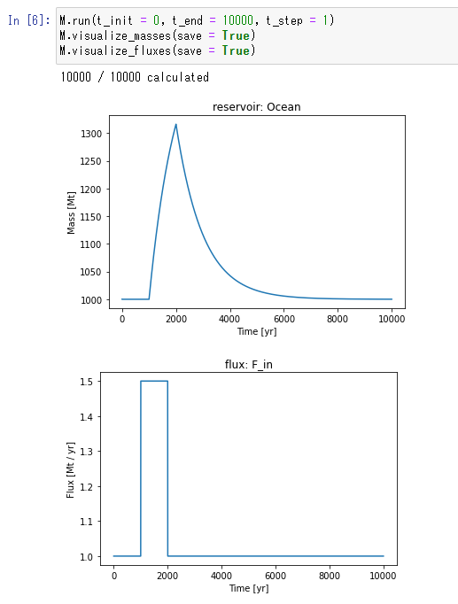
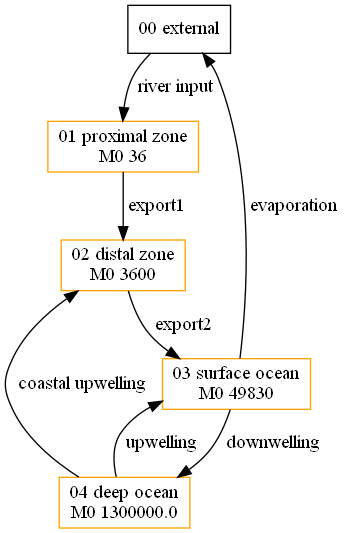

# box_model_simulator

box-model-simulator is a program developed to simulate box model problems with a simple user interface.

Only the standard Python libraries are used, except optional libraries for model visualization.

[check sample code](examples/one-box.ipynb)

## set-up
**If you want to visualize the model**

1. download and set-up Graphviz from the [official site](https://graphviz.org/download/) 
1. `pip install graphviz`
1. (If necessary) `pip install ipython`

## log
2022/3/4: version 0
